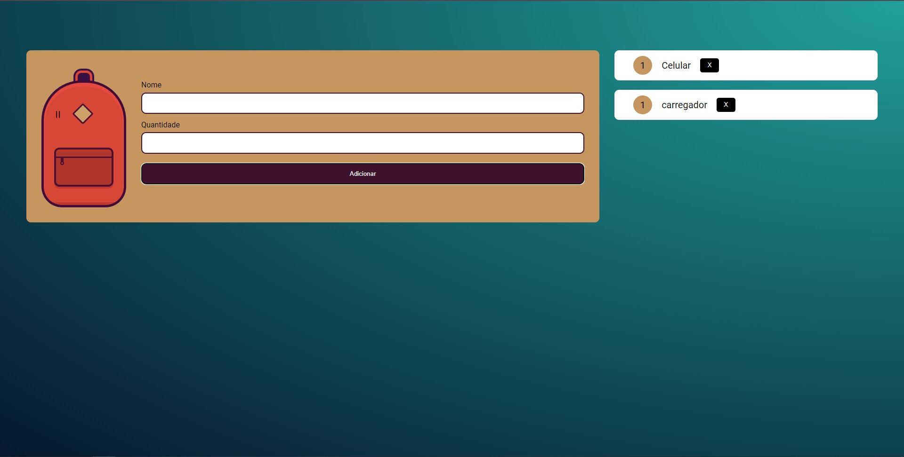

<h1 align="center"> Mochila de viagem </h1>

Um aplicativo para não esquecer nenhum "item" importante para sua viagem!

 

  

## ✔ Tecnologias

Esse projeto foi desenvolvido com as seguintes tecnologias:

- HTML / CSS
- JavaScript
- Git e Github

## 💻 Projeto

Quer evitar aquele arrependimento de chegar no local da sua viagem e notar que esqueceu aquele item importante? Utilize o app Mochila de viagem para anotar todos aqueles items importantes e estar sempre preparado!

- [Visite o projeto online] (https://patrickpicon.github.io/Alura_Mochila_de_viagem/)